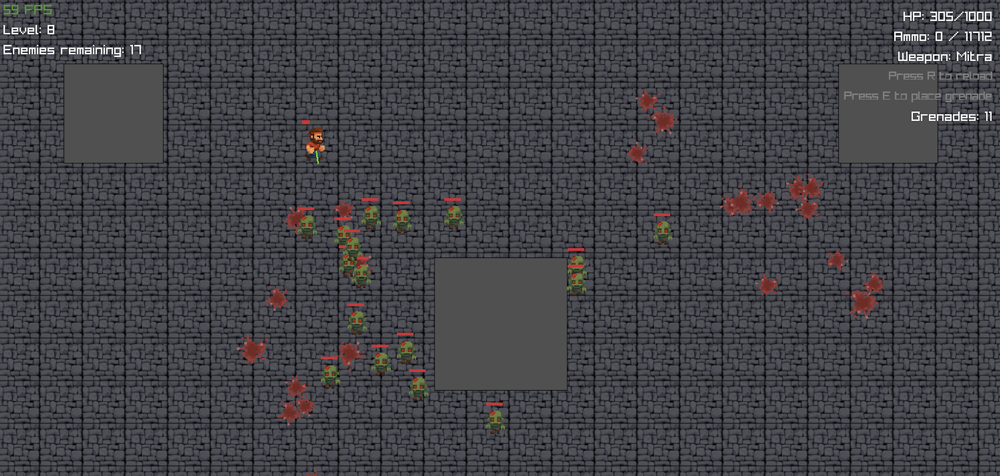

# Survivor

A top-down zombie survival game built with Go and Raylib.





## Description

Survivor is a 2D top-down shooter where you must fight off endless waves of zombies. The difficulty increases with each level as more zombies spawn with increased health and damage. How long can you survive?

## Features

- Fast-paced zombie survival gameplay
- Multiple weapons: Pistol, Shotgun, Mitra, and Minigun
- Grenade throwing mechanics
- Progressive difficulty with increasing enemy counts
- Resource management (ammo, health, grenades)
- Dynamic blood effects and impact animations
- Game statistics tracking (kills, shots fired, damage dealt, etc.)

## Requirements

- Go 1.20 or higher
- [Raylib](https://github.com/gen2brain/raylib-go) graphics library

## Installation

1. Clone the repository:
   ```
   git clone https://github.com/yourusername/survivor.git
   cd survivor
   ```

2. Build the game:
   ```
   make build
   ```

3. Run the game:
   ```
   make run
   ```


## Controls

- **WASD**: Move the player
- **Mouse**: Aim
- **Left Click**: Shoot
- **E**: Throw grenade
- **R**: Reload weapon
- **ESC**: Pause/Resume game

## Weapons

- **Pistol**: Unlimited ammo, moderate fire rate
- **Mitra**: High damage, moderate fire rate
- **Shotgun**: Multiple projectiles, slow fire rate
- **Minigun**: Very fast fire rate, low damage per bullet

## Game Mechanics

- Defeat zombies to progress through levels
- Collect weapon pickups and ammo
- Manage your health and position to avoid being overwhelmed
- Strategic use of grenades for crowd control
- Navigate around obstacles in the environment

## Development

This game is built with Go and uses the Raylib library for graphics and input handling.

### Project Structure

- `main.go`: Game loop and core functionality
- `player.go`: Player movement, rendering, and combat
- `enemy.go`: Enemy AI, movement, and rendering
- `projectile.go`: Bullet physics and collision
- `grenade.go`: Grenade mechanics
- `loot.go`: Weapon and ammo pickups
- `collision.go`: Collision detection system
- `assets/`: Game sprites and textures

## License

This project is licensed under the MIT License

